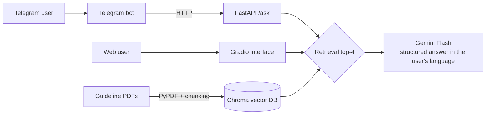

# DiaFast AI: Diabetes & Ramadan Fasting Assistant

A multilingual RAG chatbot (Moroccan Darija, Arabic, French, English) that helps people with diabetes understand whether they can fast during Ramadan. Its answers are grounded in the **IDF-DAR Practical Guidelines**.

It has two interfaces: a **web chat** (Gradio) and a **Telegram bot** that also accepts a **photo of a glucose meter**.

> ⚠️ **Research prototype, not a medical device.** It gives general information and does not replace a physician.

## Architecture



| Notebook | Role |
|---|---|
| `notebooks/1_build_vector_db.ipynb` | Loads the PDFs (362 pages), splits them into 1,049 chunks (1,000 chars, 200 overlap), embeds them and stores them in Chroma |
| `notebooks/2_rag_api.ipynb` | FastAPI service (`POST /ask`, `GET /health`) exposed through ngrok; text + optional image |
| `notebooks/3_telegram_bot.ipynb` | Telegram bot (text and photo messages) calling the API |
| `notebooks/4_gradio_interface.ipynb` | Standalone web chat with conversation history |

**Stack:** Python · LangChain · ChromaDB · sentence-transformers · Google Gemini (`google-genai`) · FastAPI · ngrok · python-telegram-bot · Gradio · Google Colab

## Answer format

Every answer follows a fixed structure, in the user's own language:

```
🔴 STATUT  : Urgent / Prudence / Sûr
✅ ACTION  : short instruction
📑 POURQUOI: one sentence grounded in the retrieved guidelines
💡 CONSEIL : practical tip
⚠️ AI disclaimer
```

The prompt also contains the risk rules (e.g. HbA1c > 9 %, glucose < 70 or > 300 mg/dL → fasting not recommended). When information is missing, the assistant asks for diabetes type, treatment, HbA1c and current glucose.

## Run it (Google Colab)

1. Put the guideline PDFs in `MyDrive/Ramadan_RAG_Data/` (see *Knowledge base*).
2. Add these in **Colab Secrets** (🔑): `GEMINI_API_KEY`, plus `NGROK_TOKEN` for the API and `TELEGRAM_TOKEN` + `API_URL` for the bot.
3. Run `1_build_vector_db` once, then either `4_gradio_interface` (web) or `2_rag_api` followed by `3_telegram_bot` (Telegram).

## Knowledge base

The PDFs are **not included** for copyright reasons. Sources used:
- IDF-DAR, *Diabetes and Ramadan: Practical Guidelines*
- IDF-DAR risk score for fasting
- Two peer-reviewed articles (Thieme, `s-0045-1814095`, `s-0045-1813010`)
- A risk-category reference document

## Limitations and roadmap

- **Embeddings:** `all-MiniLM-L6-v2` is English-centric, so retrieval on Darija questions is weak. Next step: a multilingual embedder (`multilingual-e5` / `bge-m3`) with query rewriting.
- **Safety rules:** they are currently instructions in the prompt. Next step: a deterministic rule layer (IDF-DAR risk score) applied in code before the LLM, including for photo readings.
- **Evaluation:** there is no labelled test set yet. Next step: about 30 multilingual questions with expected risk status, plus triage accuracy.
- **Citations:** answers don't yet cite the source page.
- **Deployment:** Colab + ngrok is for demos only; the API has no authentication or rate limiting.

## Author

**Mohamed Semsili**, Health Data Analyst, Casablanca
